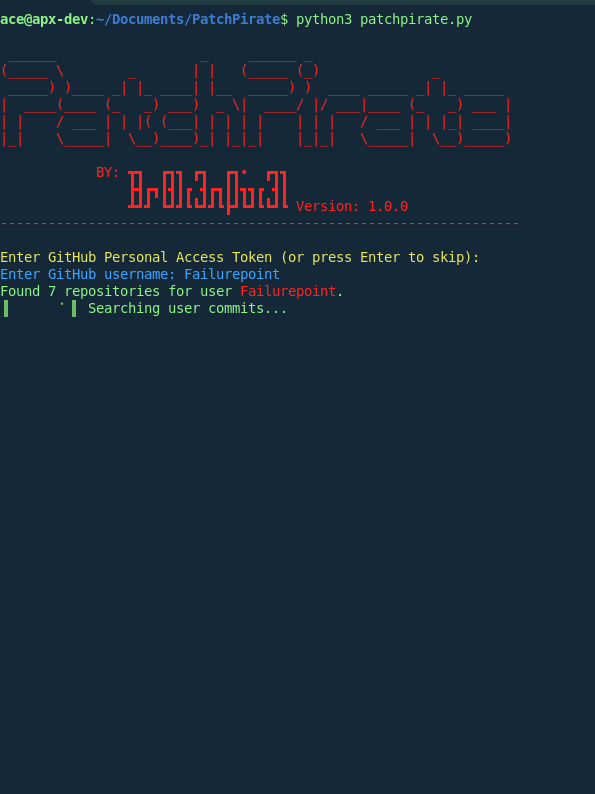
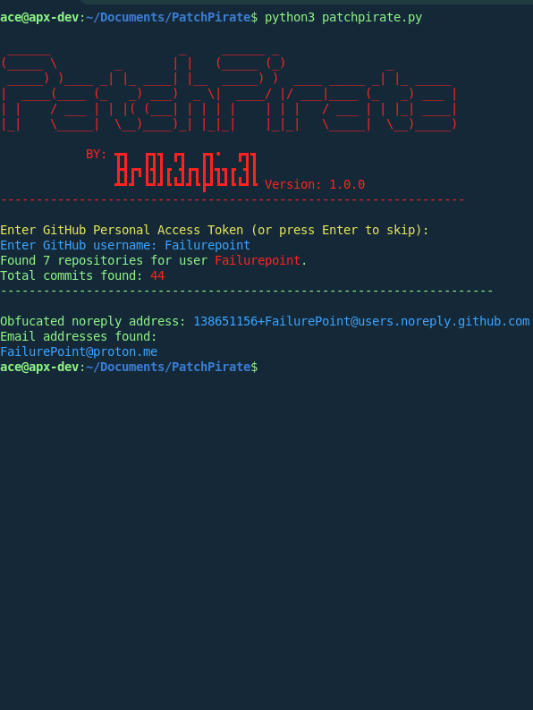

# PatchPirate
Github Recon/OSINT Software for finding personal email adresses .

PatchPirate is a Recon/OSINT software for mass processing GitHub commit and repo data to find unintentionally exposed private email addresses from a GitHub username or account via the GitHub API.

## Installation and Use
Requires python 3.11+ with pip.

To install PatchPirate on Linux run:

`git clone https://github.com/FailurePoint/PatchPirate.git & cd PatchPirate & python3 -m pip install -r requirements.txt`

Make sure to install the dependencies using this command from the program directory:

`pip install -r requirements.txt`

To run it, from the folder it is installed in run:

`python3 patchpirate.py`

## Usage and rate limmits
Usage is self obvious... please dont ask us how to use it... just use your brain for 30 secconds. it's not that hard.

GitHub imposes a rate limmit on unauthenticated users for API access of 60 requests/hr. the usage of the API varies per scan, but is roughly the same as the amount of public repos the target maintains.
If 60 requests is not going to be enough, you can run an authenticated scan using a Personal Access Token (PAT) and unlock up to 5000 requests an hour. 

## How do I get a personal access token for an authenticated scan?

https://www.geeksforgeeks.org/how-to-generate-personal-access-token-in-github/

## Screenshots

